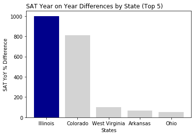

# Project 1: SAT & ACT Analysis
Syamil M.

Presentation deck available [here]()

## Problem Statement

In 2016, the College Board released a new SAT format to reflect changing trends in college education and to better prepare students for college [1](#fn1). While test preferences differ from state to state, SAT participation rates in 2018 saw a 25% increase from 2017 with 2018 having the largest number of SAT test takers since the inception of the SAT [2](#fn2). 

At the same time, the colleges throughout America are dropping standardised tests such as the ACT and SAT in favour of more streamlined admissions assessment policies [3](#fn4). Clearly, this poses a challenge for the future of standardised testing in which the SAT has an intrinsic stake. 

## Executive Summary

In light of this challenge, aggregated data from the 2017 and 2018 cohort for the SAT and ACT assessments across the 51 United States Districts have been used in this report to better understand key trends in participation rates as well as provide new ways to look into further improving SAT participation rates. From the analysis, lowering barriers towards participation via SAT School Days on top of enabling easy access to fee waivers had a clear impact in a number of states towards improving SAT participation. In some cases, we see a ten-fold increase in SAT participation for one particular state, Illinois, that made the SAT its state-wide college entrance exam.

### Contents:

- [2017 Data Import & Cleaning](#Data-Import-and-Cleaning)
- [2018 Data Import and Cleaning](#2018-Data-Import-and-Cleaning)
- [Exploratory Data Analysis](#Exploratory-Data-Analysis)
- [Data Visualization](#Visualize-the-data)
- [Descriptive and Inferential Statistics](#Descriptive-and-Inferential-Statistics)
- [Outside Research](#Outside-Research)
- [Conclusions and Recommendations](#Conclusions-and-Recommendations)
- [References](#References)

## Data Dictionary

#### SAT/ACT data dictionary

**YYYY** denotes either 2017 or 2018

|Feature|Type|Dataset|Description|
|---|---|---|---|
|**State_satYYYY / State_actYYYY**|*object (category)*|SAT/ACT 2017|Name of US State| 
|**Participation_satYYYY / Participation_actYYYY**|*integer*|SAT/ACT 2017|Participation rate of students in percentages| 
|**Evidence-Based_Reading_and_Writing_satY**|*integer*|SAT 2017|Score for Evidenced Based Reading and Writing Component of SAT (maximum is 800)| 
|**Math_satYYYY**|*integer*|SAT 2017|Score for Math Component of SAT (maximum is 800)| 
|**Total_satYYYY**|*integer*|SAT 2017|Total Score computed as a sum of Evidence-Based Reading and Writing and Math (maximum is 1600)| 
|**English_actYYYY**|*float*|ACT 2017|Score for English Component (Scaled between 1 and 36)|
|**Math_actYYYY**|*float*|ACT 2017|Score for Math Component (Scaled between 1 and 36)|
|**Reading_actYYYY**|*float*|ACT 2017|Score for Reading Component (Scaled between 1 and 36)|
|**Science_actYYYY**|*float*|ACT 2017|Score for Science Component (Scaled between 1 and 36)|
|**Composite_actYYYY**|*float*|ACT 2017|Average Score of English/Math/Reading/Science Components (Scaled between 1 and 36)|

### Key Takeaways

Lowering the barriers to accessibility for the SAT has shown a marked improvement in SAT participation rates for states that previously did not have it. The waiving of SAT fees is one such example of increasing participation. Furthermore coupled with SAT school days where tests are administered during curriculum time as part of schools' assessment schedules, participation also improved.

Intervention via enhancing PSAT (Preliminary SAT) participation for prospective test takers or reducing barriers to entry. Access to SAT training/practice tests before the graduating year can be largely discounted for students living in areas that live in ACT-dominant states. 

For example, if a student has taken a PSAT or discounted test within the last year of the SAT test date - their actual SAT test can be discounted as well. This has a twofold objective of firstly improving visibility of SAT as an option for high-schoolers looking for alternative college readiness tests and secondly reducing the uncertainty and stress that comes with taking a national-level test.

## References
1. https://collegereadiness.collegeboard.org/pdf/test-specifications-redesigned-sat-1.pdf   
2. https://reports.collegeboard.org/sat-suite-program-results/class-2018-results   
3. https://www.insidehighered.com/admissions/article/2018/07/16/more-colleges-drop-sat-writing-test-all-eyes-are-california  
4. https://blogs.edweek.org/edweek/high_school_and_beyond/2018/10/more_than_2_million_students_take_the_sat.html  
5. Image sourced from https://magoosh.com/hs/act/2017/states-that-require-the-act-or-sat/  
6. https://reports.collegeboard.org/archive/sat-suite-program-results/2017/class-2017-results   
7. https://www.orlandosentinel.com/news/education/os-ne-act-sat-florida-scores-20181024-story.html  
8. https://www.daytondailynews.com/news/historically-low-act-scores-red-flag-for-our-country/djfx9Urp719WyEaMfykyxL/ 

