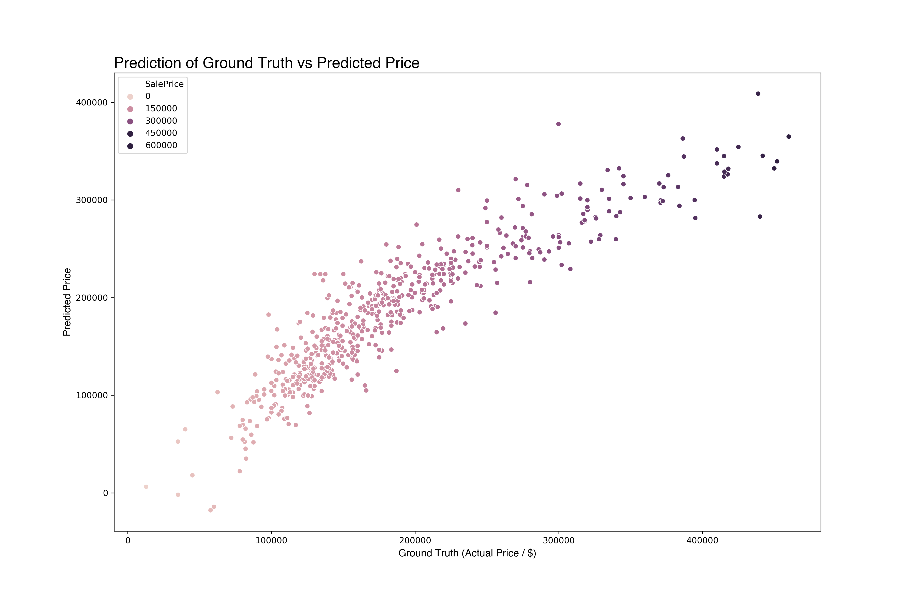

# Project 2 : Ames Housing Data and Kaggle Challenge

_Syamil M._

## Problem Statement

Given a set of information about a house, we want to be able to predict its expected price. Ideally, using the predictors, we can optimise the selling price of the house.

## Executive Summary

AMES data set contains 80 features excluding the target feature `SalePrice`. Using a combination of Exploratory Data Analysis and Feature Engineering, a model with 36 features was generated. Model benchmarking was done with reference to OLS against the Ridge, Lasso and ElasticNet methods of linear regression. Below are the scores.

| Model         | $R^2$ Score          |RMSE  |
| ------------- |---------------|------|
| Linear Regression (Benchmark)     | 0.84830 | 30111 |
| Ridge                  | 0.85112      |    29830 |
| Lasso                  | 0.84924      |    30018 |
| ElasticNet             | 0.85099      |    29924 |

Using Recursive Feature Engineering (RFE), we can reduce the model complexity to 5 key features as surmised below:

 $$
 \hat{y} = \beta_0 + \begin{align} \beta_1\textit{(age_since_built)} + \beta_2\textit{(Gr_Liv_Area)} + \beta_3\textit{(Total_Bsmt_SF)} + \beta_4\textit{(house_exter_score)} + \beta_j\textit{(Land_Contour)}_j 
 \end{align}$$ 

This model has an $R^2$ score of 0.827 and a RMSE of 32104 which is comparable to the base models with 36 features and hence would simplify the prediction process.

## Data Dictionary

#### AMES data dictionary

Original Data Dictionary [here](http://jse.amstat.org/v19n3/decock/DataDocumentation.txt)

### Key Takeaways

House age, Land Contours, Housing Scores as well as Gross floor areas are strong predictors of housing prices. Using these few variables, a prospective home seller can look into improving areas such as home quality, condition as well as look at expanding gross floor areas via careful remodelling of their homes.

To make this model location agnostic, we may impute features such as accessibility to the city (via distances) and crime rates which can affect buyer's judgement.

