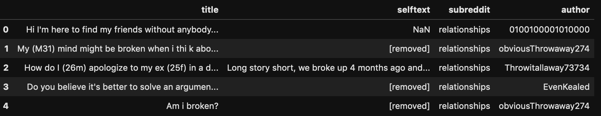
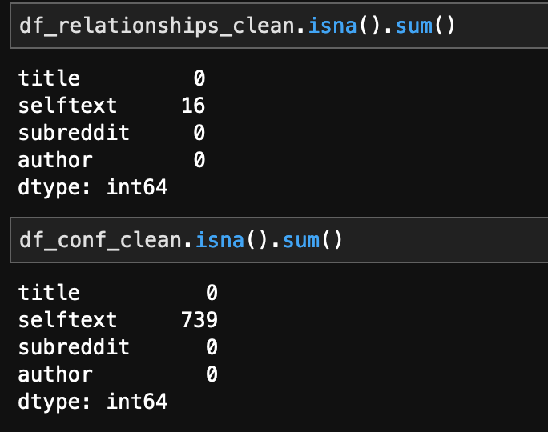
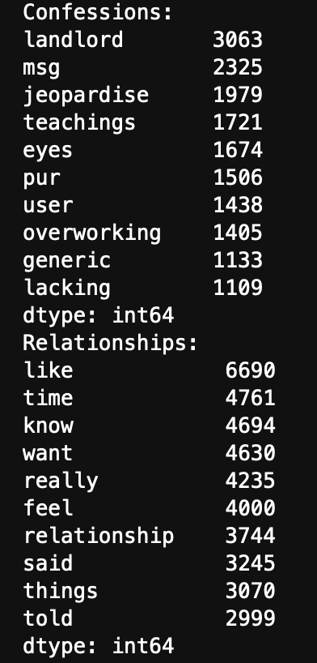
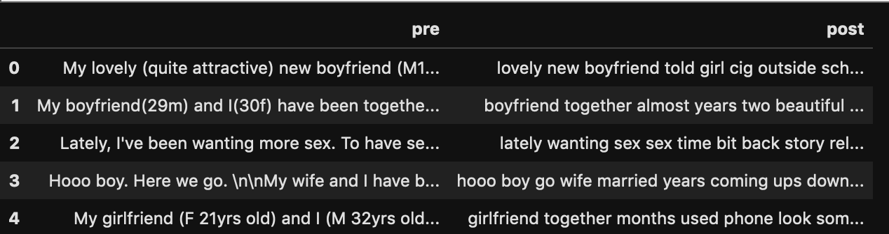
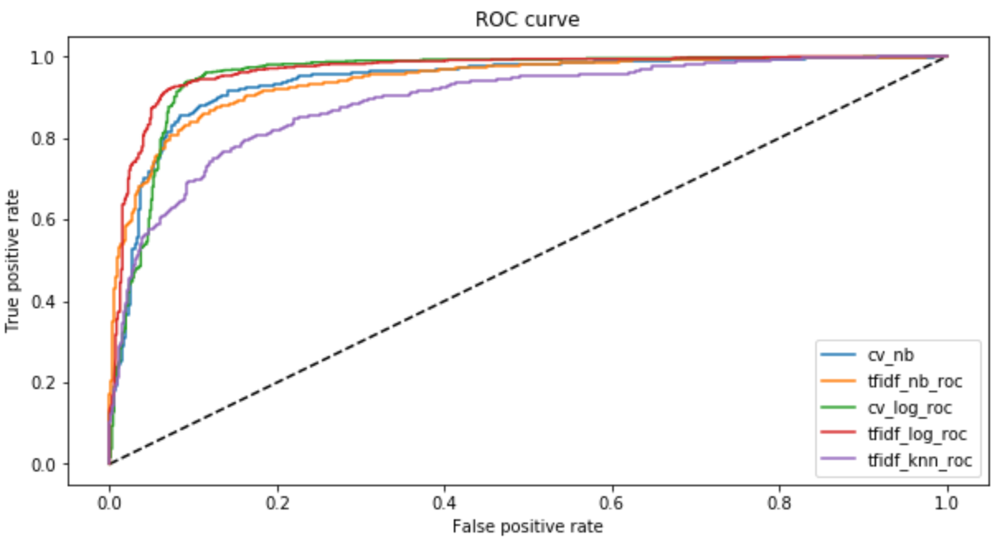

#  Project 3: Subreddit Classifier using NLP

# Problem Statement

Develop a method to differentiate posts from either the r/relationships and r/confessions subreddit.

# Data Collection

The library `psaw` was used to overcome the 1000 posts per subreddit limitation on the api. A total of 5000 posts per subreddit was requested to form the corpus.

# Data Cleaning & EDA

The post texts need to be cleaned as seen from the image above. The `deleted` , null features have to be removed before doing any further preprocessing. We can see the total number of null values below:

EDA was done to explore words commonly associated with a particular subreddit. More importantly we want to see if the top 10 words in each subreddit are vastly different from each other.

Text cleaning was done prior to the EDA that included the following:

- [ ] Converting all to lower cases
- [ ] removing groups of words in parentheses
- [ ] remove line breaks
- [ ] removing special characters (html text,etc)

A before/after snapshot can be seen below:

# Preprocessing & Modeling

Target encoding was performed on the finalised corpus where `0` corresponded to the `relationships` subreddit and `1` corresponded to the confessions subreddit.

A total of 5 classification models + vectorizers were used:
1. Multinomial Naive Bayers + CountVectorizer
2. Multinomial Naive Bayers + tfidfVectorizer
3. Logistic Regression + CountVectorizer
4. Logistic Regression + tfidfVectorizer
5. KNNClassifier + tfidfVectorizer

all five combinations had their hyperparameters tuned using `GridSearchCV`

# Evaluation 

By looking at the Receiver Operator Characteristic (ROC) curve, we observe that the logistic regression model with the tfidfVectorizer as well as the countVectorizer perform remarkably well when compared to the other combinations.

# Conclusion and Recommendations

As illustrated in the `Evaluation` portion above, the baseline logistic regression classifier gave optimal results for accurately classifying text from subreddits. 

Further work in deploying the model for real time testing is also ongoing to display `live` predictions on either subreddit.

